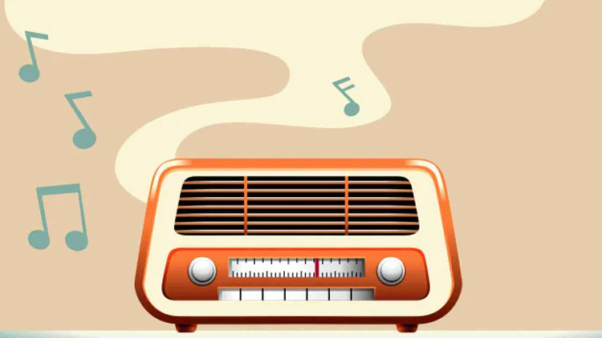

# MFK FM RADIO

MFK FM Radio is a [Buildspace](https://buildspace.so/) "Intro to Blockchain and Web3" project. You can send youtube links and people can see them, this is normal so far but! The data resides in smart contract on Ethereum Rinkeby Test Network. So you can connect your wallet and spend some fake ETH!  

You can view this site at: https://mfk-fm-radio.netlify.app/

## Available Scripts

In the project directory, you can run:

### `npm start`

Runs the app in the development mode.\
Open [http://localhost:3000](http://localhost:3000) to view it in your browser.

The page will reload when you make changes.\
You may also see any lint errors in the console.

### `npm test`

Launches the test runner in the interactive watch mode.\
See the section about [running tests](https://facebook.github.io/create-react-app/docs/running-tests) for more information.

### `npm run build`

Builds the app for production to the `build` folder.\
It correctly bundles React in production mode and optimizes the build for the best performance.

The build is minified and the filenames include the hashes.\
Your app is ready to be deployed!
